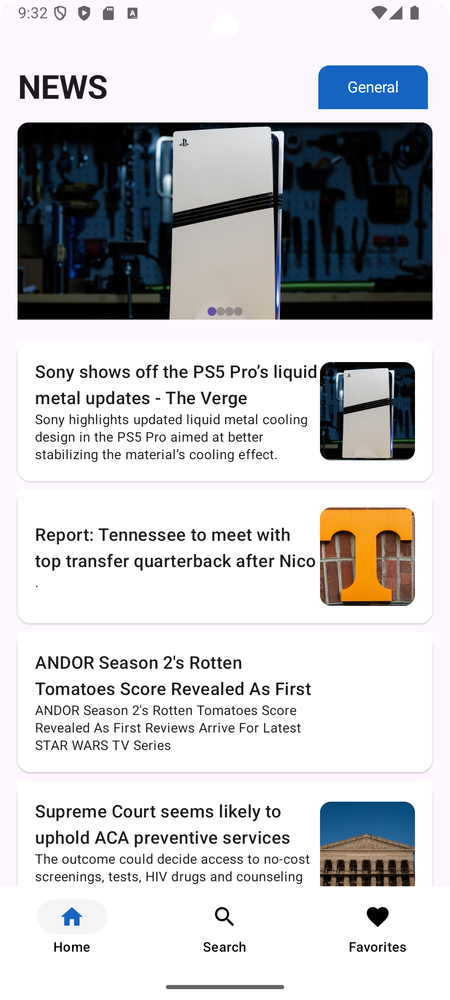
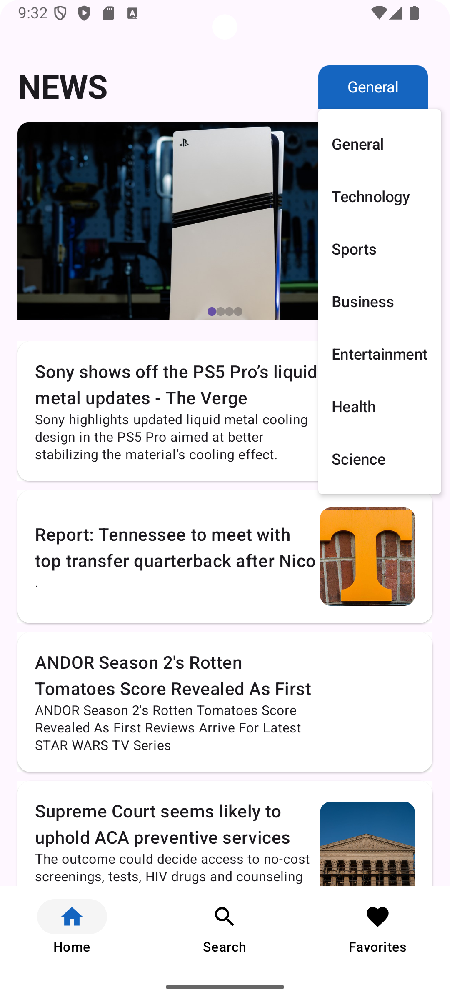
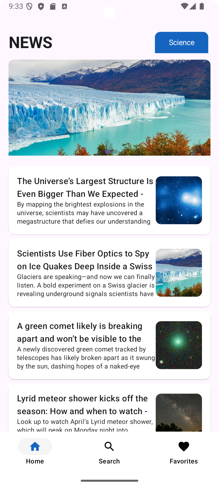

# 📰 NewsApp - Modern Android News Application


A modern Android news application built with Kotlin and Jetpack Compose, demonstrating professional-grade mobile development practices with Clean Architecture, MVVM pattern, and Dagger Hilt dependency injection.

---

## 📑 Table of Contents

- [Problem Description](#-problem-description)
- [Features Overview](#-features-overview)
- [System Architecture](#-system-architecture)
- [Use Case Diagram](#-use-case-diagram)
- [Technology Stack](#-technology-stack)
- [Package Hierarchy](#-package-hierarchy)
- [Screenshots](#-screenshots)
- [Setup Instructions](#-setup-instructions)
- [API Reference](#-api-reference)
- [Data Models](#-data-models)
- [Testing](#-testing)
- [Future Enhancements](#-future-enhancements)

---

## 📝 Problem Description

In today's fast-paced world, people need quick and easy access to the latest news from reliable sources. However, many news apps are cluttered, slow, or require multiple apps for different news categories.

**NewsApp** solves this problem by providing:
- **Unified News Access**: Single app for all news categories
- **Real-time Updates**: Latest headlines from NewsAPI.org
- **Personalization**: Favorite categories for customized news feed
- **Fast & Lightweight**: Built with modern Android technologies for optimal performance
- **Clean Interface**: Intuitive UI with Material Design 3

**Target Users**:
- News enthusiasts who want quick access to current events
- Professionals staying updated in their field
- Students researching current topics
- Anyone seeking reliable news sources

---

## ✨ Features Overview

### Core Functionalities

1. **Browse Top Headlines**
   - View latest news from NewsAPI.org
   - Filter by categories: General, Technology, Sports, Health, Business, Entertainment, Science
   - Pull-to-refresh for latest updates
   - Smooth scrolling with lazy loading

2. **Search News**
   - Real-time search functionality
   - Search across all news articles
   - Instant results display
   - Search history (planned)

3. **Favorite Categories**
   - Save preferred news categories
   - View combined articles from favorites
   - Persistent storage using DataStore
   - Easy add/remove categories

4. **Article Details**
   - Full article view with image
   - Title, description, and content
   - "See More" button to open full article in browser
   - Back navigation

5. **Bottom Navigation**
   - Easy switching between Home, Search, and Favorites
   - Material Design 3 navigation bar
   - State preservation across navigation

### Technical Features

- **Retrofit Integration**: Type-safe HTTP client for API calls
- **DataStore Preferences**: Modern data persistence
- **Coroutines**: Asynchronous programming for smooth UI
- **Navigation Component**: Type-safe navigation with arguments
- **Coil Image Loading**: Efficient async image loading with caching
- **Hilt Dependency Injection**: Automated dependency management
- **State Management**: Reactive UI with Compose State and Flow

---

## 🏗️ System Architecture

This app follows **Clean Architecture** principles with clear separation of concerns:

### Architecture Layers

```
┌─────────────────────────────────────────┐
│        Presentation Layer (UI)          │
│   - Jetpack Compose Screens             │
│   - Navigation Component                │
│   - Material Design 3 UI                │
└──────────────┬──────────────────────────┘
               │ observes state
┌──────────────▼──────────────────────────┐
│       Domain Layer (Business Logic)     │
│   - NewsViewModel                       │
│   - State Management                    │
│   - Use Cases                           │
└──────────────┬──────────────────────────┘
               │ uses
┌──────────────▼──────────────────────────┐
│         Data Layer (Data Sources)       │
│   - NewsApiService (Remote)             │
│   - DataStore (Local)                   │
│   - Repository Pattern                  │
└──────────────┬──────────────────────────┘
               │
┌──────────────▼──────────────────────────┐
│    Dependency Injection (Hilt)          │
│   - Provides all dependencies           │
│   - Manages lifecycle                   │
└─────────────────────────────────────────┘
```

**See detailed architecture diagrams**: [diagrams/system-architecture.md](diagrams/system-architecture.md)

---

## 📊 Use Case Diagram

### Main Use Cases

- **Browse Top Headlines**: View latest news with category filtering
- **Search News Articles**: Search for specific topics
- **View Article Details**: Read full article content
- **Manage Favorite Categories**: Save/remove favorite categories
- **Open in Browser**: View complete article in external browser
- **Navigate Between Screens**: Seamless navigation with bottom bar

**See detailed use case diagram**: [diagrams/use-case-diagram.md](diagrams/use-case-diagram.md)

---

## 🛠️ Technology Stack

| Category | Technology | Purpose | Version |
|----------|-----------|---------|---------|
| **Language** | Kotlin | Primary programming language | 1.9.24 |
| **UI Framework** | Jetpack Compose | Modern declarative UI | Latest |
| **Architecture** | MVVM + Clean Architecture | Separation of concerns | - |
| **DI** | Dagger Hilt | Dependency injection | 2.x |
| **Networking** | Retrofit | HTTP client | 2.x |
| **JSON Parsing** | Gson | JSON serialization | Latest |
| **Async** | Kotlin Coroutines | Asynchronous programming | Latest |
| **Navigation** | Navigation Compose | Screen navigation | Latest |
| **Local Storage** | DataStore Preferences | User preferences | Latest |
| **Image Loading** | Coil | Async image loading | Latest |
| **State Management** | Compose State & Flow | Reactive state | Latest |
| **Testing** | JUnit, Mockk | Unit testing | Latest |

### Why These Technologies?

- **Jetpack Compose**: Modern UI toolkit with less boilerplate, better performance
- **Dagger Hilt**: Simplified DI with compile-time verification
- **Retrofit**: Industry-standard HTTP client with coroutine support
- **Coroutines**: Structured concurrency for clean async code
- **DataStore**: Modern replacement for SharedPreferences
- **Clean Architecture**: Maintainable, testable, and scalable codebase

---

## 📦 Package Hierarchy (Mandatory)

```
com.example.newsapp/
│
├── di/                          # Dependency Injection Layer
│   ├── Module.kt               # Hilt module providing dependencies
│   └── NewsApp.kt              # Application class
│
├── model/                       # Data Layer
│   ├── Article.kt              # Article data model
│   ├── NewsResponse.kt         # API response model
│   ├── NewsApiService.kt       # Retrofit API interface
│   └── RetrofitInstance.kt     # Retrofit configuration
│
├── viewmodel/                   # Domain Layer
│   └── NewsViewModel.kt        # Business logic & state management
│
├── view/                        # Presentation Layer
│   ├── HomeScreen.kt           # Home screen UI
│   ├── SearchScreen.kt         # Search screen UI
│   ├── FavoriteScreen.kt       # Favorites screen UI
│   └── NewsDetailScreen.kt     # Detail screen UI
│
├── navigation/                  # Navigation Layer
│   ├── NewsApp.kt              # Navigation host
│   └── Screen.kt               # Screen routes
│
├── ui/theme/                    # UI Theme
│   ├── Color.kt                # Color definitions
│   ├── Theme.kt                # Material theme
│   └── Type.kt                 # Typography
│
└── Utils.kt                     # Utility functions
```

**Clean Architecture Layers**:
- **Presentation**: `view/`, `navigation/`, `ui/`
- **Domain**: `viewmodel/`
- **Data**: `model/`
- **DI**: `di/`

**See detailed package structure**: [diagrams/package-hierarchy.md](diagrams/package-hierarchy.md)

---

## 📱 Screenshots / Screen Flow

The app includes the following screens:

1. **Home Screen** - Top headlines with category filtering
2. **Search Screen** - Search news by keywords
3. **Favorites Screen** - Articles from favorite categories
4. **Detail Screen** - Full article view with browser link
5. **Navigation Flow** - Bottom navigation between screens

<p align="center">
  
  
  
  
</p>

---

## 🚀 Setup Instructions

### Prerequisites
- Android Studio Hedgehog or later
- JDK 11 or higher
- Android SDK 33+
- Git

### Steps to Clone, Open, and Run

1. **Clone the repository**:
   ```bash
   git clone https://github.com/devabdallahragheb/NewsApp.git
   cd NewsApp-master
   ```

2. **Open in Android Studio**:
   - Launch Android Studio
   - Select "Open an Existing Project"
   - Navigate to the cloned directory
   - Click "OK"

3. **Sync Gradle files**:
   - Android Studio will automatically prompt to sync
   - Or click "File" → "Sync Project with Gradle Files"

4. **Build the project**:
   ```bash
   ./gradlew build
   ```

5. **Run on emulator or device**:
   - Connect an Android device or start an emulator
   - Click the "Run" button (▶️) in Android Studio
   - Or use command line:
   ```bash
   ./gradlew installDebug
   ```

### Configuration

The app uses NewsAPI.org. The API key is currently hardcoded in `RetrofitInstance.kt`:
```kotlin
const val API_KEY = "7768e4b1d5e94336909d210aa8fb50fd"
```

**For production**, move the API key to:
- `local.properties` (not committed to Git)
- Or use BuildConfig
- Or environment variables

---

## 🌐 API Reference

### Base URL
```
https://newsapi.org/
```

### Endpoints Used

#### 1. Get Top Headlines
```http
GET /v2/top-headlines
```

**Parameters**:
| Parameter | Type | Required | Description |
|-----------|------|----------|-------------|
| `country` | String | No | Country code (default: "us") |
| `category` | String | No | News category |
| `apiKey` | String | Yes | Your API key |

**Categories**: general, technology, sports, health, business, entertainment, science

**Example**:
```kotlin
newsApiService.getTopHeadlines(
    country = "us",
    category = "technology",
    apiKey = API_KEY
)
```

#### 2. Search Everything
```http
GET /v2/everything
```

**Parameters**:
| Parameter | Type | Required | Description |
|-----------|------|----------|-------------|
| `q` | String | Yes | Search query |
| `apiKey` | String | Yes | Your API key |

**Example**:
```kotlin
newsApiService.searchNews(
    query = "kotlin android",
    apiKey = API_KEY
)
```

### Response Format

```json
{
  "articles": [
    {
      "title": "Article Title",
      "description": "Article description",
      "urlToImage": "https://example.com/image.jpg",
      "url": "https://example.com/article",
      "content": "Article content..."
    }
  ]
}
```

---

## 📄 Data Models

### Article.kt
```kotlin
data class Article(
    val title: String,           // Article headline
    val description: String?,    // Short description
    val urlToImage: String?,     // Image URL
    val url: String,             // Full article URL
    val content: String? = null  // Article content
)
```

### NewsResponse.kt
```kotlin
data class NewsResponse(
    val articles: List<Article>  // List of articles from API
)
```

### Room Entities (Future Enhancement)
Currently, the app doesn't use Room database. For offline support, these entities could be added:
- `ArticleEntity` - Cached articles
- `CategoryEntity` - Saved categories

---

## 🧪 Testing (Mandatory - ViewModel Only)

### ViewModel Unit Tests

**File**: `app/src/test/java/com/example/newsapp/viewmodel/NewsViewModelTest.kt`

```kotlin
class NewsViewModelTest {
    
    @Test
    fun `loadHeadlines updates articles state`() {
        // Test that loading headlines updates the state correctly
    }
    
    @Test
    fun `searchNews returns filtered results`() {
        // Test search functionality
    }
    
    @Test
    fun `updateFavoriteCategories persists to DataStore`() {
        // Test favorite category management
    }
    
    @Test
    fun `setSelectedCategory saves to SavedStateHandle`() {
        // Test category selection persistence
    }
}
```

### Running Tests

```bash
# Run all unit tests
./gradlew test

# Run specific test class
./gradlew test --tests NewsViewModelTest

# Run with coverage
./gradlew testDebugUnitTestCoverage
```

### Testing Tools
- **JUnit**: Unit testing framework
- **MockK**: Mocking library for Kotlin
- **Coroutines Test**: Testing coroutines
- **Turbine**: Testing Flow emissions

---

## 🔮 Future Enhancements / Limitations

### Planned Features
1. **Offline Support**: Cache articles using Room database
2. **Bookmarks**: Save individual articles for later
3. **Share Functionality**: Share articles via social media
4. **Push Notifications**: Breaking news alerts
5. **Multi-language Support**: Internationalization (i18n)
6. **Dark Mode**: Complete theme switching
7. **Pagination**: Load more articles with paging
8. **Advanced Filters**: Date range, source filtering
9. **User Authentication**: Personalized experience
10. **Article Comments**: Community engagement

### Current Limitations
- No offline mode (requires internet connection)
- Limited error handling UI
- No article bookmarking
- Single language (English)
- No user authentication
- No push notifications
- Basic search (no advanced filters)

### Technical Improvements
- Add Room database for caching
- Implement WorkManager for background sync
- Add Paging 3 for infinite scroll
- Enhance error handling with sealed classes
- Add comprehensive unit and UI tests
- Implement analytics tracking
- Add crash reporting (Firebase Crashlytics)

---

## 📚 Additional Documentation

- **[Presentation Document](PRESENTATION.md)** - Complete project presentation
- **[Use Case Diagram](diagrams/use-case-diagram.md)** - UML use case diagram
- **[System Architecture](diagrams/system-architecture.md)** - Detailed architecture diagrams
- **[Package Hierarchy](diagrams/package-hierarchy.md)** - Complete package structure

---

## 📄 License

This project is licensed under the MIT License. See the [LICENSE](LICENSE) file for details.

---

## 👨‍💻 Contact

For questions, feedback, or contributions:

- **GitHub**: [devabdallahragheb](https://github.com/devabdallahragheb)
- **Email**: your-email@example.com

---

## 🙏 Acknowledgments

- **NewsAPI.org** for providing the news data API
- **Android Developers** for excellent documentation
- **Jetpack Compose** community for resources and support

---

**Built with ❤️ using Kotlin and Jetpack Compose**