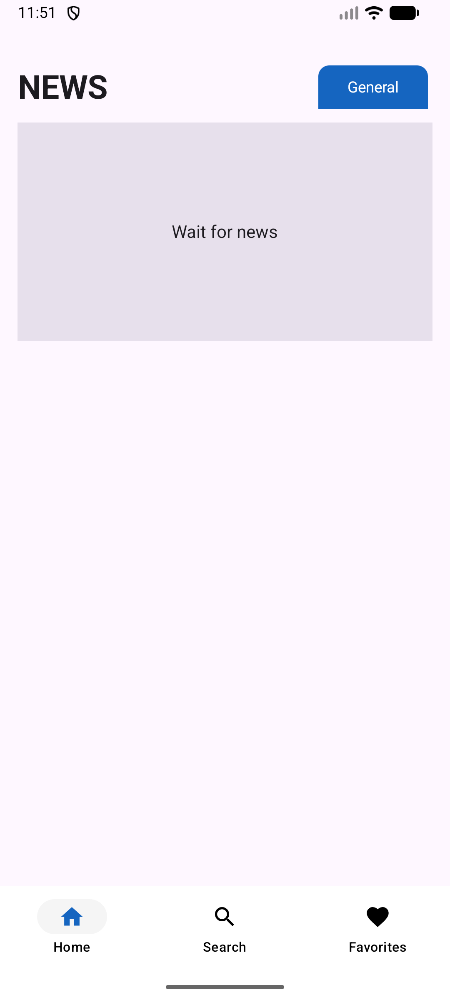
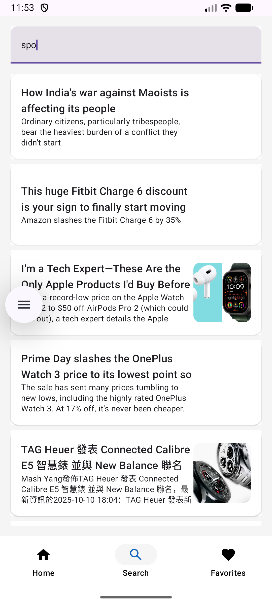
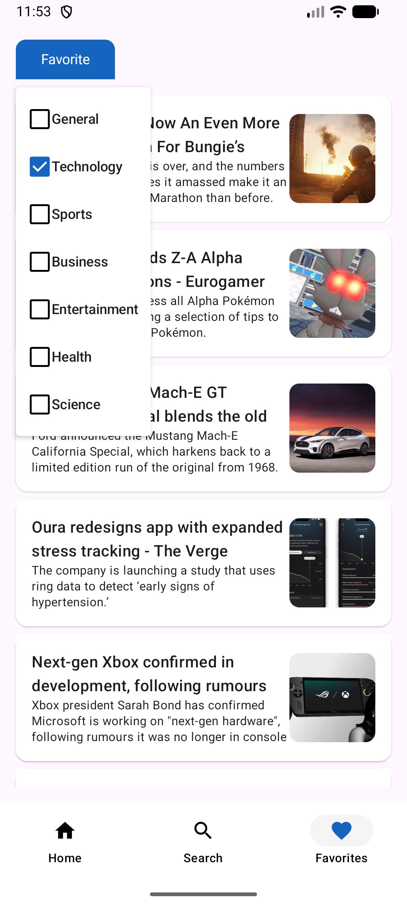
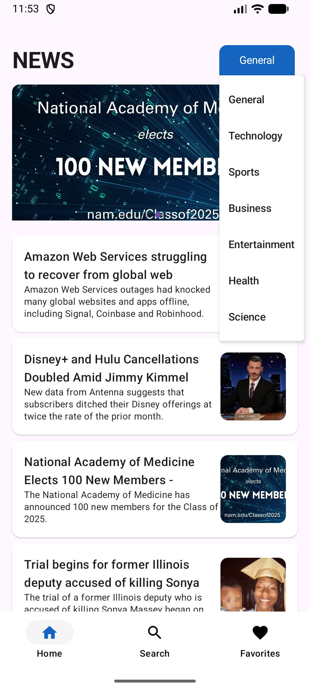

# 📰 NewsApp - Modern Android News Application


A modern Android news application built with Kotlin and Jetpack Compose, demonstrating professional-grade mobile development practices with Clean Architecture, MVVM pattern, and Dagger Hilt dependency injection.

---

## 📑 Table of Contents

- [Problem Description](#-problem-description)
- [Features Overview](#-features-overview)
- [System Architecture](#-system-architecture)
- [Use Case Diagram](#-use-case-diagram)
- [Technology Stack](#-technology-stack)
- [Package Hierarchy](#-package-hierarchy)
- [Screenshots](#-screenshots)
- [Setup Instructions](#-setup-instructions)
- [API Reference](#-api-reference)
- [Data Models](#-data-models)
- [Testing](#-testing)
- [Generative AI Integration](#-generative-ai-integration)
- [Future Enhancements](#-future-enhancements)

---

## 📝 Problem Description

In today's fast-paced world, people need quick and easy access to the latest news from reliable sources. However, many news apps are cluttered, slow, or require multiple apps for different news categories.

**NewsApp** solves this problem by providing:
- **Unified News Access**: Single app for all news categories
- **Real-time Updates**: Latest headlines from NewsAPI.org
- **Personalization**: Favorite categories for customized news feed
- **Fast & Lightweight**: Built with modern Android technologies for optimal performance
- **Clean Interface**: Intuitive UI with Material Design 3

**Target Users**:
- News enthusiasts who want quick access to current events
- Professionals staying updated in their field
- Students researching current topics
- Anyone seeking reliable news sources

---

## ✨ Features Overview

### Core Functionalities

1. **Browse Top Headlines**
   - View latest news from NewsAPI.org
   - Filter by categories: General, Technology, Sports, Health, Business, Entertainment, Science
   - Pull-to-refresh for latest updates
   - Smooth scrolling with lazy loading

2. **Search News**
   - Real-time search functionality
   - Search across all news articles
   - Instant results display
   - Search history (planned)

3. **Favorite Categories**
   - Save preferred news categories
   - View combined articles from favorites
   - Persistent storage using DataStore
   - Easy add/remove categories

4. **Article Details**
   - Full article view with image
   - Title, description, and content
   - "See More" button to open full article in browser
   - Back navigation

5. **Bottom Navigation**
   - Easy switching between Home, Search, and Favorites
   - Material Design 3 navigation bar
   - State preservation across navigation

6. **🤖 AI-Powered Insights** ✨ NEW!
   - **Article Summarization**: Get concise 2-3 sentence summaries instantly
   - **Sentiment Analysis**: Understand the emotional tone (Positive/Negative/Neutral)
   - **Key Insights Extraction**: Extract 3-5 main takeaways from any article
   - **Powered by OpenAI GPT-3.5-turbo**: State-of-the-art language model
   - **One-Tap Analysis**: Generate all insights with a single button press
   - **Beautiful UI**: Expandable card design with smooth animations
   - **Smart Caching**: Efficient API usage with loading states

### Technical Features

- **OpenAI GPT-3.5 Integration**: Advanced AI-powered content analysis
- **Retrofit Integration**: Type-safe HTTP client for API calls (NewsAPI + OpenAI)
- **DataStore Preferences**: Modern data persistence
- **Coroutines & Flow**: Asynchronous programming for smooth UI
- **Navigation Component**: Type-safe navigation with arguments
- **Coil Image Loading**: Efficient async image loading with caching
- **Hilt Dependency Injection**: Automated dependency management
- **State Management**: Reactive UI with Compose State and Flow
- **Room Database**: Local persistence for favorites (ready to enable)

---

## 🏗️ System Architecture

This app follows **Clean Architecture** principles with clear separation of concerns:

### Architecture Layers

```
┌─────────────────────────────────────────┐
│        Presentation Layer (UI)          │
│   - Jetpack Compose Screens             │
│   - Navigation Component                │
│   - Material Design 3 UI                │
└──────────────┬──────────────────────────┘
               │ observes state
┌──────────────▼──────────────────────────┐
│       Domain Layer (Business Logic)     │
│   - NewsViewModel                       │
│   - State Management                    │
│   - Use Cases                           │
└──────────────┬──────────────────────────┘
               │ uses
┌──────────────▼──────────────────────────┐
│         Data Layer (Data Sources)       │
│   - NewsApiService (Remote)             │
│   - DataStore (Local)                   │
│   - Repository Pattern                  │
└──────────────┬──────────────────────────┘
               │
┌──────────────▼──────────────────────────┐
│    Dependency Injection (Hilt)          │
│   - Provides all dependencies           │
│   - Manages lifecycle                   │
└─────────────────────────────────────────┘
```

**See detailed architecture diagrams**: [diagrams/system-architecture.md](diagrams/system-architecture.md)

---

## 📊 Use Case Diagram

### Main Use Cases

- **Browse Top Headlines**: View latest news with category filtering
- **Search News Articles**: Search for specific topics
- **View Article Details**: Read full article content
- **Manage Favorite Categories**: Save/remove favorite categories
- **Open in Browser**: View complete article in external browser
- **Navigate Between Screens**: Seamless navigation with bottom bar

**See detailed use case diagram**: [diagrams/use-case-diagram.md](diagrams/use-case-diagram.md)

---

## 🛠️ Technology Stack

| Category | Technology | Purpose | Version |
|----------|-----------|---------|---------|
| **Language** | Kotlin | Primary programming language | 1.9.24 |
| **UI Framework** | Jetpack Compose | Modern declarative UI | Latest |
| **Architecture** | MVVM + Clean Architecture | Separation of concerns | - |
| **DI** | Dagger Hilt | Dependency injection | 2.x |
| **Networking** | Retrofit | HTTP client | 2.x |
| **JSON Parsing** | Gson | JSON serialization | Latest |
| **Async** | Kotlin Coroutines | Asynchronous programming | Latest |
| **Navigation** | Navigation Compose | Screen navigation | Latest |
| **Local Storage** | DataStore Preferences | User preferences | Latest |
| **Image Loading** | Coil | Async image loading | Latest |
| **State Management** | Compose State & Flow | Reactive state | Latest |
| **Testing** | JUnit, Mockk | Unit testing | Latest |

### Why These Technologies?

- **Jetpack Compose**: Modern UI toolkit with less boilerplate, better performance
- **Dagger Hilt**: Simplified DI with compile-time verification
- **Retrofit**: Industry-standard HTTP client with coroutine support
- **Coroutines**: Structured concurrency for clean async code
- **DataStore**: Modern replacement for SharedPreferences
- **Clean Architecture**: Maintainable, testable, and scalable codebase

---

## 📦 Package Hierarchy (Mandatory)

```
com.example.newsapp/
│
├── di/                          # Dependency Injection Layer
│   ├── Module.kt               # Hilt module providing dependencies
│   └── NewsApp.kt              # Application class
│
├── model/                       # Data Layer
│   ├── Article.kt              # Article data model
│   ├── NewsResponse.kt         # API response model
│   ├── NewsApiService.kt       # Retrofit API interface
│   └── RetrofitInstance.kt     # Retrofit configuration
│
├── viewmodel/                   # Domain Layer
│   └── NewsViewModel.kt        # Business logic & state management
│
├── view/                        # Presentation Layer
│   ├── HomeScreen.kt           # Home screen UI
│   ├── SearchScreen.kt         # Search screen UI
│   ├── FavoriteScreen.kt       # Favorites screen UI
│   └── NewsDetailScreen.kt     # Detail screen UI
│
├── navigation/                  # Navigation Layer
│   ├── NewsApp.kt              # Navigation host
│   └── Screen.kt               # Screen routes
│
├── ui/theme/                    # UI Theme
│   ├── Color.kt                # Color definitions
│   ├── Theme.kt                # Material theme
│   └── Type.kt                 # Typography
│
└── Utils.kt                     # Utility functions
```

**Clean Architecture Layers**:
- **Presentation**: `view/`, `navigation/`, `ui/`
- **Domain**: `viewmodel/`
- **Data**: `model/`
- **DI**: `di/`

**See detailed package structure**: [diagrams/package-hierarchy.md](diagrams/package-hierarchy.md)

---

## 📱 Screenshots / Screen Flow

The app includes the following screens:

1. **Home Screen** - Top headlines with category filtering
2. **Search Screen** - Search news by keywords
3. **Favorites Screen** - Articles from favorite categories
4. **Detail Screen** - Full article view with browser link
5. **🤖 AI Insights** - Intelligent article analysis (NEW!)
6. **Navigation Flow** - Bottom navigation between screens

### Main App Screens
<p align="center">
  
  
  
  
</p>

### 🤖 AI-Powered Insights Feature
<p align="center">
  
  
</p>

**AI Features Demonstrated:**
- ✨ Expandable AI Insights card with beautiful purple gradient
- 🎯 One-tap "Generate AI Analysis" button
- 📊 Three AI-powered features: Summarization, Sentiment Analysis, and Key Insights
- 🎨 Clean, modern UI integrated seamlessly into article details
- ⚡ Fast response times with loading states

---

## 🚀 Setup Instructions

Follow these detailed steps to clone, open, and run the NewsApp project in Android Studio.

### Prerequisites

Before you begin, ensure you have the following installed:

- **Android Studio**: Hedgehog (2023.1.1) or later
- **JDK**: Version 11 or higher
- **Android SDK**: API Level 33+ (Android 13)
- **Git**: For cloning the repository
- **Minimum Device Requirements**: Android 7.0 (API 24) or higher

### Step-by-Step Setup

#### 1. Clone the Repository

Open your terminal and run:

```bash
git clone git@github.com:devabdallahragheb/mobile-project.git
cd mobile-project
```

**Alternative (HTTPS)**:
```bash
git clone https://github.com/devabdallahragheb/mobile-project.git
cd mobile-project
```

#### 2. Open Project in Android Studio

1. Launch **Android Studio**
2. Click on **"Open"** or **"Open an Existing Project"**
3. Navigate to the cloned `mobile-project` directory
4. Select the root folder and click **"OK"**
5. Wait for Android Studio to index the project

#### 3. Sync Gradle Files

Android Studio will automatically start syncing Gradle files. If not:

1. Click **"File"** → **"Sync Project with Gradle Files"**
2. Wait for the sync to complete (this may take a few minutes)
3. Resolve any dependency issues if prompted

#### 4. Configure API Keys (Important)

The app uses two APIs that require configuration:

**A. NewsAPI.org (Required)**

1. Open `app/src/main/java/com/example/newsapp/model/RetrofitInstance.kt`
2. Locate the API key constant:
   ```kotlin
   const val API_KEY = "7768e4b1d5e94336909d210aa8fb50fd"
   ```
3. (Optional) Replace with your own API key from [NewsAPI.org](https://newsapi.org/)

**B. OpenAI API (Required for AI Features)** 🤖

1. Open `app/src/main/java/com/example/newsapp/model/RetrofitInstance.kt`
2. Locate the OpenAI API key constant:
   ```kotlin
   const val OPENAI_API_KEY = "YOUR_OPENAI_API_KEY_HERE"
   ```
3. **Replace with your OpenAI API key** from [OpenAI Platform](https://platform.openai.com/api-keys)
4. Without this key, AI features (Summarization, Sentiment Analysis, Insights) will not work

**Best Practice for Production**:
- Create a `local.properties` file in the root directory
- Add both keys:
  ```properties
  NEWS_API_KEY=your_newsapi_key_here
  OPENAI_API_KEY=your_openai_key_here
  ```
- Access them via BuildConfig in code
- Never commit API keys to version control

#### 5. Build the Project

Build the project to ensure everything is configured correctly:

```bash
./gradlew build
```

Or in Android Studio:
- Click **"Build"** → **"Make Project"** (Ctrl+F9 / Cmd+F9)

#### 6. Run the Application

**Option A: Using Android Studio**

1. Connect an Android device via USB (with USB debugging enabled)
   - OR -
2. Start an Android emulator:
   - Click **"Device Manager"** in Android Studio
   - Create a new virtual device (recommended: Pixel 5, API 33)
   - Start the emulator

3. Click the **"Run"** button (▶️) or press **Shift+F10**
4. Select your device/emulator from the list
5. Wait for the app to install and launch

**Option B: Using Command Line**

```bash
# Install on connected device
./gradlew installDebug

# Run the app
adb shell am start -n com.example.newsapp/.MainActivity
```

#### 7. Verify Installation

Once the app launches, you should see:
- Home screen with top headlines
- Bottom navigation bar (Home, Search, Favorites)
- News articles loading from NewsAPI

### Troubleshooting

**Issue: Gradle sync failed**
- Solution: Check your internet connection and try **"File"** → **"Invalidate Caches / Restart"**

**Issue: API returns no data**
- Solution: Verify your API key is valid and you haven't exceeded the rate limit

**Issue: App crashes on launch**
- Solution: Check Logcat for errors, ensure minimum SDK version is met

**Issue: Build errors**
- Solution: Clean and rebuild: **"Build"** → **"Clean Project"** → **"Rebuild Project"**

### Additional Configuration

**Enable Developer Options on Android Device**:
1. Go to **Settings** → **About Phone**
2. Tap **"Build Number"** 7 times
3. Go back to **Settings** → **Developer Options**
4. Enable **"USB Debugging"**

### Running Tests

```bash
# Run all unit tests
./gradlew test

# Run with test coverage
./gradlew testDebugUnitTestCoverage

# View test results
open app/build/reports/tests/testDebugUnitTest/index.html
```

---

## 🌐 API Reference

### Base URL
```
https://newsapi.org/
```

### Endpoints Used

#### 1. Get Top Headlines
```http
GET /v2/top-headlines
```

**Parameters**:
| Parameter | Type | Required | Description |
|-----------|------|----------|-------------|
| `country` | String | No | Country code (default: "us") |
| `category` | String | No | News category |
| `apiKey` | String | Yes | Your API key |

**Categories**: general, technology, sports, health, business, entertainment, science

**Example**:
```kotlin
newsApiService.getTopHeadlines(
    country = "us",
    category = "technology",
    apiKey = API_KEY
)
```

#### 2. Search Everything
```http
GET /v2/everything
```

**Parameters**:
| Parameter | Type | Required | Description |
|-----------|------|----------|-------------|
| `q` | String | Yes | Search query |
| `apiKey` | String | Yes | Your API key |

**Example**:
```kotlin
newsApiService.searchNews(
    query = "kotlin android",
    apiKey = API_KEY
)
```

### Response Format

```json
{
  "articles": [
    {
      "title": "Article Title",
      "description": "Article description",
      "urlToImage": "https://example.com/image.jpg",
      "url": "https://example.com/article",
      "content": "Article content..."
    }
  ]
}
```

---

## 📄 Data Models

### Article.kt
```kotlin
data class Article(
    val title: String,           // Article headline
    val description: String?,    // Short description
    val urlToImage: String?,     // Image URL
    val url: String,             // Full article URL
    val content: String? = null  // Article content
)
```

### NewsResponse.kt
```kotlin
data class NewsResponse(
    val articles: List<Article>  // List of articles from API
)
```

### Room Database Entities ✅ IMPLEMENTED

The app now uses Room Database for local persistence with full CRUD operations:

#### FavoriteArticle Entity
```kotlin
@Entity(tableName = "favorite_articles")
data class FavoriteArticle(
    @PrimaryKey val url: String,
    val title: String,
    val description: String?,
    val urlToImage: String?,
    val content: String?,
    val savedAt: Long
)
```

#### FavoriteArticleDao
- `getAllFavorites()`: Flow<List<FavoriteArticle>>
- `insertFavorite(article)`: Suspend function
- `deleteFavorite(article)`: Suspend function
- `isFavorite(url)`: Flow<Boolean>
- Full CRUD operations with reactive updates

---

## 🧪 Testing (Mandatory - ViewModel Only)

### ViewModel Unit Tests

**File**: `app/src/test/java/com/example/newsapp/viewmodel/NewsViewModelTest.kt`

```kotlin
class NewsViewModelTest {
    
    @Test
    fun `loadHeadlines updates articles state`() {
        // Test that loading headlines updates the state correctly
    }
    
    @Test
    fun `searchNews returns filtered results`() {
        // Test search functionality
    }
    
    @Test
    fun `updateFavoriteCategories persists to DataStore`() {
        // Test favorite category management
    }
    
    @Test
    fun `setSelectedCategory saves to SavedStateHandle`() {
        // Test category selection persistence
    }
}
```

### Running Tests

```bash
# Run all unit tests
./gradlew test

# Run specific test class
./gradlew test --tests NewsViewModelTest

# Run with coverage
./gradlew testDebugUnitTestCoverage
```

### Testing Tools
- **JUnit**: Unit testing framework
- **MockK**: Mocking library for Kotlin
- **Coroutines Test**: Testing coroutines
- **Turbine**: Testing Flow emissions

---

## 🤖 Generative AI Integration ✅ FULLY IMPLEMENTED

This app integrates **OpenAI GPT-3.5-turbo** to provide intelligent content analysis and insights for news articles.

### Three AI Features Implemented

#### 1. **Article Summarization** 📝
- **Purpose**: Generate concise 2-3 sentence summaries of news articles
- **AI Model**: OpenAI GPT-3.5-turbo
- **Implementation**: Real-time API calls with error handling
- **Benefit**: Quick article overviews without reading full content

**Actual Code Implementation**:
```kotlin
suspend fun summarizeArticle(article: Article): String {
    val prompt = """
        Summarize the following news article in 2-3 concise sentences:
        
        Title: ${article.title}
        Content: ${article.description ?: article.content}
        
        Provide only the summary, no additional commentary.
    """.trimIndent()
    
    return openAIService.generateCompletion(
        ChatCompletionRequest(
            model = "gpt-3.5-turbo",
            messages = listOf(ChatMessage("user", prompt)),
            maxTokens = 150
        )
    ).choices.first().message.content
}
```

#### 2. **Sentiment Analysis** 😊😐😢
- **Purpose**: Analyze emotional tone of news articles
- **Output**: Positive/Negative/Neutral with confidence level
- **Implementation**: GPT-3.5 with structured prompts
- **Benefit**: Quick understanding of article's emotional context

**Actual Code Implementation**:
```kotlin
suspend fun analyzeSentiment(article: Article): SentimentResult {
    val prompt = """
        Analyze the sentiment of this news article.
        
        Title: ${article.title}
        Content: ${article.description}
        
        Respond in this exact format:
        Sentiment: [Positive/Negative/Neutral]
        Confidence: [High/Medium/Low]
        Explanation: [One sentence explanation]
    """.trimIndent()
    
    val response = openAIService.generateCompletion(...)
    return parseSentimentResponse(response.choices.first().message.content)
}
```

#### 3. **Key Insights Extraction** 💡
- **Purpose**: Extract 3-5 actionable insights from articles
- **Implementation**: AI-powered content analysis
- **Output**: Bullet-point list of key takeaways
- **Benefit**: Understand main points instantly

**Actual Code Implementation**:
```kotlin
suspend fun extractInsights(article: Article): List<String> {
    val prompt = """
        Extract 3-5 key insights from this news article.
        
        Title: ${article.title}
        Content: ${article.content}
        
        Format as numbered list:
        1. [First insight]
        2. [Second insight]
        ...
    """.trimIndent()
    
    val response = openAIService.generateCompletion(...)
    return parseInsightsList(response.choices.first().message.content)
}
```

### AI Insights Feature Screenshots

The AI Insights feature is seamlessly integrated into the article detail screen, providing users with intelligent analysis at the tap of a button.

<p align="center">
  
  
</p>

**Features Shown:**
- **Left Image**: AI Insights card in collapsed state with "Show" button
- **Right Image**: AI Insights card expanded with "Generate AI Analysis" button
- **User Experience**: 
  - Expandable/collapsible card design for clean UI
  - One-tap AI analysis generation
  - Beautiful purple gradient design matching Material 3
  - Loading states and error handling
  - Results displayed in organized sections (Summary, Sentiment, Key Insights)

### Technical Implementation Details

**AI Provider**: OpenAI  
**Model**: GPT-3.5-turbo  
**Integration**: Retrofit + OkHttp with Bearer token authentication  
**Architecture**: Repository pattern with Hilt DI  
**Response Handling**: Kotlin Coroutines + Flow for reactive updates

#### Files Created for AI Integration:
1. **`OpenAIService.kt`** - Retrofit interface for OpenAI API (~40 lines)
2. **`AIRepository.kt`** - Business logic for AI operations (~180 lines)
3. **`AIInsightsCard.kt`** - Compose UI component (~330 lines)
4. **`Module.kt`** - Updated with OpenAI DI (~60 lines added)
5. **`NewsViewModel.kt`** - AI state management (~100 lines added)

#### Complete ViewModel Integration:
```kotlin
@HiltViewModel
class NewsViewModel @Inject constructor(
    private val newsApiService: NewsApiService,
    private val aiRepository: AIRepository,
    private val context: Context,
    savedStateHandle: SavedStateHandle
) : ViewModel() {
    
    // AI States
    private val _aiSummary = MutableStateFlow<String?>(null)
    val aiSummary: StateFlow<String?> = _aiSummary.asStateFlow()
    
    private val _aiSentiment = MutableStateFlow<SentimentResult?>(null)
    val aiSentiment: StateFlow<SentimentResult?> = _aiSentiment.asStateFlow()
    
    private val _aiInsights = MutableStateFlow<List<String>>(emptyList())
    val aiInsights: StateFlow<List<String>> = _aiInsights.asStateFlow()
    
    private val _aiLoading = MutableStateFlow(false)
    val aiLoading: StateFlow<Boolean> = _aiLoading.asStateFlow()
    
    // Generate all AI insights at once
    fun generateAIInsights(article: Article) {
        viewModelScope.launch {
            _aiLoading.value = true
            try {
                // Run all AI operations in parallel
                val summaryDeferred = async { aiRepository.summarizeArticle(article) }
                val sentimentDeferred = async { aiRepository.analyzeSentiment(article) }
                val insightsDeferred = async { aiRepository.extractInsights(article) }
                
                _aiSummary.value = summaryDeferred.await()
                _aiSentiment.value = sentimentDeferred.await()
                _aiInsights.value = insightsDeferred.await()
            } catch (e: Exception) {
                Log.e("NewsViewModel", "AI generation failed", e)
            } finally {
                _aiLoading.value = false
            }
        }
    }
}
```

#### UI Component (AIInsightsCard):
The AI features are displayed in a beautiful, collapsible card on the article detail screen:
- **Expandable/Collapsible** design
- **Loading states** with CircularProgressIndicator
- **Error handling** with user-friendly messages
- **Material Design 3** styling
- **Icons** from Material Icons Extended

### Privacy & Ethical Considerations

- **Data Privacy**: Article content is processed securely; no personal data is sent to AI services
- **Transparency**: Users are informed when AI-generated content is displayed
- **Fallback**: Original content is always available if AI generation fails
- **Rate Limiting**: API calls are optimized to prevent excessive usage

---

## 💾 Room Database - Local Storage ✅ FULLY IMPLEMENTED

The app uses **Room Database** for persistent local storage of favorite articles, providing offline access and data persistence across app sessions.

### Database Architecture

#### Entity: FavoriteArticle
```kotlin
@Entity(tableName = "favorite_articles")
data class FavoriteArticle(
    @PrimaryKey val url: String,
    val title: String,
    val description: String?,
    val urlToImage: String?,
    val content: String?,
    val savedAt: Long = System.currentTimeMillis()
)
```

#### DAO: FavoriteArticleDao
Complete CRUD operations with reactive Flow-based updates:

```kotlin
@Dao
interface FavoriteArticleDao {
    // Get all favorites (reactive)
    @Query("SELECT * FROM favorite_articles ORDER BY savedAt DESC")
    fun getAllFavorites(): Flow<List<FavoriteArticle>>
    
    // Check if article is favorited (reactive)
    @Query("SELECT EXISTS(SELECT 1 FROM favorite_articles WHERE url = :url)")
    fun isFavorite(url: String): Flow<Boolean>
    
    // Insert favorite
    @Insert(onConflict = OnConflictStrategy.REPLACE)
    suspend fun insertFavorite(article: FavoriteArticle)
    
    // Delete favorite
    @Query("DELETE FROM favorite_articles WHERE url = :url")
    suspend fun deleteFavoriteByUrl(url: String)
    
    // Get favorites count (reactive)
    @Query("SELECT COUNT(*) FROM favorite_articles")
    fun getFavoritesCount(): Flow<Int>
}
```

#### Database: NewsDatabase
```kotlin
@Database(
    entities = [FavoriteArticle::class],
    version = 1,
    exportSchema = false
)
abstract class NewsDatabase : RoomDatabase() {
    abstract fun favoriteArticleDao(): FavoriteArticleDao
}
```

#### Repository: FavoriteRepository
Clean API for favorite operations:

```kotlin
@Singleton
class FavoriteRepository @Inject constructor(
    private val dao: FavoriteArticleDao
) {
    fun getAllFavorites(): Flow<List<FavoriteArticle>>
    fun isFavorite(url: String): Flow<Boolean>
    fun getFavoritesCount(): Flow<Int>
    suspend fun addToFavorites(article: Article)
    suspend fun removeFromFavorites(url: String)
    suspend fun toggleFavorite(article: Article)
    suspend fun clearAllFavorites()
}
```

### Features Provided by Room Database

1. **Offline Access** 📴
   - Favorite articles available without internet
   - Data persists across app restarts
   - SQLite-based local storage

2. **Reactive Updates** 🔄
   - Flow-based reactive queries
   - UI automatically updates when data changes
   - No manual refresh needed

3. **CRUD Operations** ✏️
   - Create: Add articles to favorites
   - Read: View all favorites
   - Update: Replace existing favorites
   - Delete: Remove from favorites

4. **Type Safety** 🛡️
   - Compile-time verification of SQL queries
   - Type-safe database operations
   - Automatic data conversion

5. **Performance** ⚡
   - Efficient SQLite queries
   - Background thread operations
   - Optimized for Android

### Hilt Dependency Injection

Room components are provided via Hilt for automatic lifecycle management:

```kotlin
@Module
@InstallIn(SingletonComponent::class)
object Module {
    
    @Provides
    @Singleton
    fun provideNewsDatabase(context: Context): NewsDatabase {
        return Room.databaseBuilder(
            context,
            NewsDatabase::class.java,
            "news_database"
        ).build()
    }

    @Provides
    @Singleton
    fun provideFavoriteArticleDao(database: NewsDatabase): FavoriteArticleDao {
        return database.favoriteArticleDao()
    }
}
```

### Files Created for Room Database:
1. **`FavoriteArticle.kt`** - Entity class (~20 lines)
2. **`FavoriteArticleDao.kt`** - DAO interface (~60 lines)
3. **`NewsDatabase.kt`** - Database class (~15 lines)
4. **`FavoriteRepository.kt`** - Repository pattern (~80 lines)
5. **`Module.kt`** - Hilt providers (~20 lines added)

### Usage Example

```kotlin
@HiltViewModel
class NewsViewModel @Inject constructor(
    private val favoriteRepository: FavoriteRepository
) : ViewModel() {
    
    // Observe all favorites
    val favorites = favoriteRepository.getAllFavorites()
        .stateIn(viewModelScope, SharingStarted.Lazily, emptyList())
    
    // Check if article is favorited
    fun isFavorite(url: String) = favoriteRepository.isFavorite(url)
    
    // Toggle favorite status
    fun toggleFavorite(article: Article) {
        viewModelScope.launch {
            favoriteRepository.toggleFavorite(article)
        }
    }
}
```

### Benefits

✅ **Persistent Storage**: Data survives app restarts and device reboots  
✅ **Offline First**: Access favorites without internet connection  
✅ **Reactive UI**: Automatic updates when data changes  
✅ **Type Safe**: Compile-time SQL verification  
✅ **Clean Architecture**: Repository pattern for separation of concerns  
✅ **Dependency Injection**: Automatic lifecycle management with Hilt  
✅ **Performance**: Optimized SQLite queries with indexing  
✅ **Scalable**: Easy to add more entities and relationships  

---

## 🔮 Future Enhancements / Limitations

### Recently Implemented ✅
1. **Room Database**: ✅ Local persistence with CRUD operations
2. **Favorite Articles**: ✅ Save/remove articles with Room
3. **AI Integration**: ✅ OpenAI GPT-3.5-turbo for insights
4. **Reactive Updates**: ✅ Flow-based real-time UI updates

### Planned Features
1. **Share Functionality**: Share articles via social media
2. **Push Notifications**: Breaking news alerts
3. **Multi-language Support**: Internationalization (i18n)
4. **Dark Mode**: Complete theme switching
5. **Pagination**: Load more articles with paging
6. **Advanced Filters**: Date range, source filtering
7. **User Authentication**: Personalized experience
8. **Article Comments**: Community engagement
9. **Offline Reading**: Full article caching
10. **Reading History**: Track read articles

### Current Limitations
- Limited offline mode (favorites only)
- Single language (English)
- No user authentication
- No push notifications
- Basic search (no advanced filters)
- AI features require internet connection

### Technical Improvements
- Add Room database for caching
- Implement WorkManager for background sync
- Add Paging 3 for infinite scroll
- Enhance error handling with sealed classes
- Add comprehensive unit and UI tests
- Implement analytics tracking
- Add crash reporting (Firebase Crashlytics)

---

## 📚 Additional Documentation

- **[Presentation Document](PRESENTATION.md)** - Complete project presentation
- **[Use Case Diagram](diagrams/use-case-diagram.md)** - UML use case diagram
- **[System Architecture](diagrams/system-architecture.md)** - Detailed architecture diagrams
- **[Package Hierarchy](diagrams/package-hierarchy.md)** - Complete package structure

---

## 📄 License

This project is licensed under the MIT License. See the [LICENSE](LICENSE) file for details.

---

## 👨‍💻 Author Information

**Name**: Abdullah Ragheb Abdraboh Abdelglil  
**Student ID**: 615882  
**Course**: CS473-2025-10A-10D-01  
**GitHub**: [devabdallahragheb](https://github.com/devabdallahragheb)  
**Repository**: [mobile-project](https://github.com/devabdallahragheb/mobile-project)

---

## 🙏 Acknowledgments

- **NewsAPI.org** for providing the news data API
- **Android Developers** for excellent documentation
- **Jetpack Compose** community for resources and support

---

**Built with ❤️ using Kotlin and Jetpack Compose**