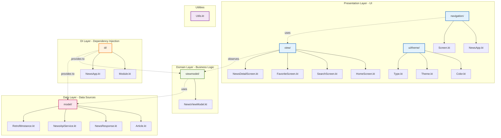

# Package Hierarchy - News App

## Project Folder Structure

```
NewsApp-master/
│
├── app/
│   ├── src/
│   │   ├── main/
│   │   │   ├── java/com/example/newsapp/
│   │   │   │   │
│   │   │   │   ├── di/                          # Dependency Injection Layer
│   │   │   │   │   ├── Module.kt                # Hilt module for DI
│   │   │   │   │   └── NewsApp.kt               # Application class
│   │   │   │   │
│   │   │   │   ├── model/                       # Data Layer
│   │   │   │   │   ├── Article.kt               # Article data class
│   │   │   │   │   ├── NewsResponse.kt          # API response model
│   │   │   │   │   ├── NewsApiService.kt        # Retrofit API interface
│   │   │   │   │   └── RetrofitInstance.kt      # Retrofit configuration
│   │   │   │   │
│   │   │   │   ├── viewmodel/                   # Domain Layer
│   │   │   │   │   └── NewsViewModel.kt         # Business logic & state
│   │   │   │   │
│   │   │   │   ├── view/                        # Presentation Layer
│   │   │   │   │   ├── HomeScreen.kt            # Home screen UI
│   │   │   │   │   ├── SearchScreen.kt          # Search screen UI
│   │   │   │   │   ├── FavoriteScreen.kt        # Favorites screen UI
│   │   │   │   │   ├── NewsDetailScreen.kt      # Detail screen UI
│   │   │   │   │   └── components/              # Reusable UI components
│   │   │   │   │
│   │   │   │   ├── navigation/                  # Navigation Layer
│   │   │   │   │   ├── NewsApp.kt               # Navigation host
│   │   │   │   │   └── Screen.kt                # Screen routes
│   │   │   │   │
│   │   │   │   ├── ui/                          # UI Theme & Components
│   │   │   │   │   └── theme/
│   │   │   │   │       ├── Color.kt             # Color definitions
│   │   │   │   │       ├── Theme.kt             # App theme
│   │   │   │   │       └── Type.kt              # Typography
│   │   │   │   │
│   │   │   │   └── Utils.kt                     # Utility functions
│   │   │   │
│   │   │   ├── res/                             # Resources
│   │   │   │   ├── drawable/                    # Images & icons
│   │   │   │   ├── values/
│   │   │   │   │   ├── strings.xml              # String resources
│   │   │   │   │   ├── colors.xml               # Color resources
│   │   │   │   │   └── themes.xml               # Theme resources
│   │   │   │   └── mipmap/                      # App icons
│   │   │   │
│   │   │   └── AndroidManifest.xml              # App manifest
│   │   │
│   │   ├── test/                                # Unit tests
│   │   │   └── java/com/example/newsapp/
│   │   │       └── viewmodel/
│   │   │           └── NewsViewModelTest.kt
│   │   │
│   │   └── androidTest/                         # Instrumented tests
│   │       └── java/com/example/newsapp/
│   │           └── ui/
│   │               └── NewsAppTest.kt
│   │
│   ├── build.gradle.kts                         # App-level Gradle
│   └── proguard-rules.pro                       # ProGuard rules
│
├── gradle/                                      # Gradle wrapper
│   └── libs.versions.toml                       # Version catalog
│
├── diagrams/                                    # Project diagrams
│   ├── use-case-diagram.md
│   ├── system-architecture.md
│   └── package-hierarchy.md
│
├── build.gradle.kts                             # Project-level Gradle
├── settings.gradle.kts                          # Gradle settings
├── gradle.properties                            # Gradle properties
├── README.md                                    # Project documentation
├── PRESENTATION.md                              # Presentation document
└── .gitignore                                   # Git ignore rules
```

## Clean Architecture Layer Mapping



## Package Details

### 1. di/ - Dependency Injection Layer

**Purpose**: Manages dependency injection using Dagger Hilt

**Files**:
- `Module.kt` - Provides singleton instances
- `NewsApp.kt` - Application class annotated with @HiltAndroidApp

**Key Components**:
```kotlin
@Module
@InstallIn(SingletonComponent::class)
object Module {
    @Provides @Singleton fun provideRetrofit(): Retrofit
    @Provides @Singleton fun provideNewsApiService(retrofit: Retrofit): NewsApiService
    @Provides @Singleton fun provideApiKey(): String
    @Provides @Singleton fun provideContext(application: Application): Context
}
```

**Responsibilities**:
- Configure Hilt modules
- Provide dependencies
- Manage singleton instances
- Application-level setup

---

### 2. model/ - Data Layer

**Purpose**: Handles data models and remote data sources

**Files**:
- `Article.kt` - Article data class
- `NewsResponse.kt` - API response wrapper
- `NewsApiService.kt` - Retrofit API interface
- `RetrofitInstance.kt` - Retrofit configuration

**Key Components**:

**Article.kt**:
```kotlin
data class Article(
    val title: String,
    val description: String?,
    val urlToImage: String?,
    val url: String,
    val content: String? = null
)
```

**NewsResponse.kt**:
```kotlin
data class NewsResponse(
    val articles: List<Article>
)
```

**NewsApiService.kt**:
```kotlin
interface NewsApiService {
    @GET("v2/top-headlines")
    suspend fun getTopHeadlines(
        @Query("country") country: String = "us",
        @Query("category") category: String? = null,
        @Query("apiKey") apiKey: String
    ): NewsResponse
    
    @GET("v2/everything")
    suspend fun searchNews(
        @Query("q") query: String,
        @Query("apiKey") apiKey: String
    ): NewsResponse
}
```

**Responsibilities**:
- Define data models
- API endpoint definitions
- Network configuration
- Data serialization/deserialization

---

### 3. viewmodel/ - Domain Layer

**Purpose**: Contains business logic and state management

**Files**:
- `NewsViewModel.kt` - Main ViewModel

**Key Components**:
```kotlin
@HiltViewModel
class NewsViewModel @Inject constructor(
    val newsApiService: NewsApiService,
    val apiKey: String,
    val context: Context,
    val savedStateHandle: SavedStateHandle
) : ViewModel() {
    
    // State
    private val _articles = mutableStateOf<List<Article>>(emptyList())
    val articles: State<List<Article>> = _articles
    
    private val _searchArticles = mutableStateOf<List<Article>>(emptyList())
    val searchArticle: State<List<Article>> = _searchArticles
    
    private val _favoriteArticles = mutableStateOf<List<Article>>(emptyList())
    val favoriteArticles: State<List<Article>> = _favoriteArticles
    
    // Business Logic
    fun loadHeadlines(category: String)
    fun searchNews(query: String)
    fun loadFavoriteArticles()
    fun updateFavoriteCategories(category: String, isSelected: Boolean)
    fun setSelectedCategory(category: String)
}
```

**Responsibilities**:
- Manage UI state
- Execute business logic
- Coordinate data operations
- Handle coroutine scopes
- Persist state across configuration changes

---

### 4. view/ - Presentation Layer

**Purpose**: UI screens built with Jetpack Compose

**Files**:
- `HomeScreen.kt` - Main news feed
- `SearchScreen.kt` - Search functionality
- `FavoriteScreen.kt` - Favorite categories
- `NewsDetailScreen.kt` - Article details

**Key Components**:

**HomeScreen.kt**:
```kotlin
@Composable
fun HomeScreen(
    viewModel: NewsViewModel,
    onArticleClick: (Article) -> Unit
) {
    // Category selection
    // Article list
    // Pull to refresh
}
```

**SearchScreen.kt**:
```kotlin
@Composable
fun SearchScreen(
    viewModel: NewsViewModel,
    onArticleClick: (Article) -> Unit
) {
    // Search input
    // Search results
}
```

**FavoriteScreen.kt**:
```kotlin
@Composable
fun FavoriteScreen(
    viewModel: NewsViewModel,
    onArticleClick: (Article) -> Unit
) {
    // Favorite categories
    // Favorite articles
}
```

**NewsDetailScreen.kt**:
```kotlin
@Composable
fun NewsDetailScreen(
    article: Article,
    onBackClick: () -> Unit
) {
    // Article image
    // Title, description, content
    // Open in browser button
}
```

**Responsibilities**:
- Render UI
- Handle user interactions
- Observe ViewModel state
- Display data
- Navigate between screens

---

### 5. navigation/ - Navigation Layer

**Purpose**: Manages app navigation

**Files**:
- `NewsApp.kt` - Navigation host and bottom navigation
- `Screen.kt` - Screen route definitions

**Key Components**:

**NewsApp.kt**:
```kotlin
@Composable
fun NewsApp(viewModel: NewsViewModel = hiltViewModel()) {
    val navController = rememberNavController()
    
    Scaffold(
        bottomBar = { NavigationBar(...) }
    ) {
        NavHost(
            navController = navController,
            startDestination = Screen.Home.route
        ) {
            composable(Screen.Home.route) { HomeScreen(...) }
            composable(Screen.Search.route) { SearchScreen(...) }
            composable(Screen.Favorites.route) { FavoriteScreen(...) }
            composable("news_detail?...") { NewsDetailScreen(...) }
        }
    }
}
```

**Screen.kt**:
```kotlin
sealed class Screen(val route: String) {
    object Home : Screen("Home")
    object Search : Screen("Search")
    object Favorites : Screen("Favorites")
}
```

**Responsibilities**:
- Define navigation graph
- Handle navigation actions
- Pass arguments between screens
- Manage bottom navigation
- Maintain back stack

---

### 6. ui/theme/ - UI Theme Layer

**Purpose**: App theming and styling

**Files**:
- `Color.kt` - Color definitions
- `Theme.kt` - Material theme configuration
- `Type.kt` - Typography definitions

**Key Components**:

**Color.kt**:
```kotlin
val button = Color(0xFF6200EE)
val back = Color(0xFFF5F5F5)
```

**Theme.kt**:
```kotlin
@Composable
fun NewsAppTheme(
    darkTheme: Boolean = isSystemInDarkTheme(),
    content: @Composable () -> Unit
) {
    MaterialTheme(
        colorScheme = if (darkTheme) darkColorScheme else lightColorScheme,
        typography = Typography,
        content = content
    )
}
```

**Responsibilities**:
- Define color palette
- Configure Material theme
- Set typography
- Support dark mode

---

### 7. Utils.kt - Utilities

**Purpose**: Helper functions and extensions

**Key Components**:
```kotlin
fun String.encode(): String {
    return URLEncoder.encode(this, StandardCharsets.UTF_8.toString())
}

fun String.decode(): String {
    return URLDecoder.decode(this, StandardCharsets.UTF_8.toString())
}

val FAVORITE_CATEGORIES_KEY = stringPreferencesKey("favorite_categories")

val Context.dataStore: DataStore<Preferences> by preferencesDataStore(name = "settings")
```

**Responsibilities**:
- URL encoding/decoding
- DataStore configuration
- Extension functions
- Constants

---

## Gradle Configuration

### build.gradle.kts (App Level)

```kotlin
plugins {
    alias(libs.plugins.android.application)
    alias(libs.plugins.kotlin.android)
    alias(libs.plugins.kotlin.compose)
    id("com.google.dagger.hilt.android")
    id("kotlin-kapt")
    id("org.jetbrains.kotlin.plugin.serialization")
}

dependencies {
    // AndroidX Core + Lifecycle
    implementation(libs.androidx.core.ktx)
    implementation(libs.androidx.lifecycle.runtime.ktx)
    implementation(libs.androidx.lifecycle.viewmodel.ktx)
    implementation(libs.androidx.activity.compose)
    implementation(libs.androidx.navigation.compose)
    implementation(libs.androidx.datastore.preferences)
    implementation(libs.androidx.hilt.navigation.compose)

    // Jetpack Compose
    implementation(platform(libs.androidx.compose.bom))
    implementation(libs.androidx.compose.ui)
    implementation(libs.androidx.compose.ui.graphics)
    implementation(libs.androidx.compose.ui.tooling.preview)
    implementation(libs.androidx.compose.material3)

    // Hilt
    implementation(libs.hilt.android)
    kapt(libs.hilt.compiler)

    // Image Loading
    implementation(libs.coil.compose)

    // Retrofit + JSON
    implementation(libs.retrofit)
    implementation(libs.retrofit.gson)
    implementation(libs.serialization.json)

    // Coroutines
    implementation(libs.coroutines.core)
    implementation(libs.coroutines.android)

    // Testing
    testImplementation(libs.junit)
    androidTestImplementation(libs.androidx.junit)
    androidTestImplementation(libs.androidx.espresso.core)
}
```

---

## Resource Organization

### res/ Directory

```
res/
├── drawable/              # Vector drawables, images
│   └── ic_launcher_*.xml
│
├── mipmap/               # App icons (different densities)
│   ├── ic_launcher.png
│   ├── ic_launcher_round.png
│   └── ...
│
├── values/               # Resource values
│   ├── strings.xml       # String resources
│   ├── colors.xml        # Color resources
│   └── themes.xml        # Theme definitions
│
└── values-night/         # Dark theme resources
    └── themes.xml
```

---

## Testing Structure

### test/ - Unit Tests

```
test/java/com/example/newsapp/
├── viewmodel/
│   └── NewsViewModelTest.kt      # ViewModel unit tests
│
├── model/
│   └── ArticleTest.kt            # Data model tests
│
└── utils/
    └── UtilsTest.kt              # Utility function tests
```

### androidTest/ - Instrumented Tests

```
androidTest/java/com/example/newsapp/
├── ui/
│   ├── HomeScreenTest.kt         # UI tests for HomeScreen
│   ├── SearchScreenTest.kt       # UI tests for SearchScreen
│   └── NavigationTest.kt         # Navigation tests
│
└── di/
    └── TestModule.kt             # Test DI module
```

---

## Architecture Compliance

### Clean Architecture Layers

| Layer | Package | Responsibility |
|-------|---------|----------------|
| **Presentation** | `view/`, `navigation/`, `ui/` | UI rendering, user interaction |
| **Domain** | `viewmodel/` | Business logic, state management |
| **Data** | `model/` | Data sources, API calls |
| **DI** | `di/` | Dependency injection |

### Dependency Rules

✅ **Allowed Dependencies**:
- Presentation → Domain
- Domain → Data
- DI → All layers

❌ **Forbidden Dependencies**:
- Data → Domain
- Data → Presentation
- Domain → Presentation

### Package Naming Convention

- **Lowercase**: All package names use lowercase
- **Descriptive**: Names clearly indicate purpose
- **Organized**: Related classes grouped together
- **Consistent**: Same structure across features

---

## File Naming Conventions

### Kotlin Files
- **Screens**: `*Screen.kt` (e.g., `HomeScreen.kt`)
- **ViewModels**: `*ViewModel.kt` (e.g., `NewsViewModel.kt`)
- **Models**: `*.kt` (e.g., `Article.kt`)
- **Services**: `*Service.kt` (e.g., `NewsApiService.kt`)
- **Modules**: `Module.kt`
- **Utils**: `Utils.kt`

### Resource Files
- **Layouts**: `activity_*.xml`, `fragment_*.xml`
- **Drawables**: `ic_*.xml`, `bg_*.xml`
- **Strings**: `strings.xml`
- **Colors**: `colors.xml`
- **Themes**: `themes.xml`

---

## Summary

This package hierarchy follows **Clean Architecture** principles with clear separation of concerns:

1. **Presentation Layer** (`view/`, `navigation/`, `ui/`) - User interface
2. **Domain Layer** (`viewmodel/`) - Business logic
3. **Data Layer** (`model/`) - Data management
4. **DI Layer** (`di/`) - Dependency injection

Each layer has well-defined responsibilities and dependencies flow in one direction, making the codebase maintainable, testable, and scalable.
