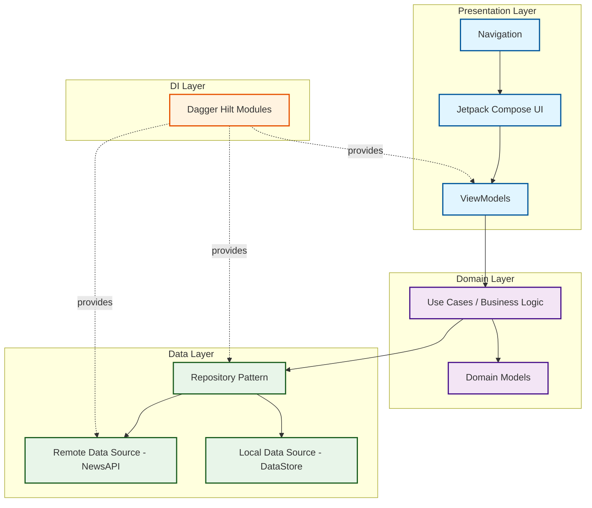
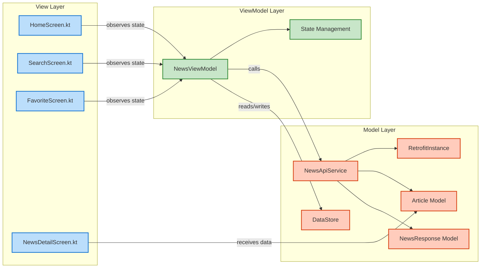
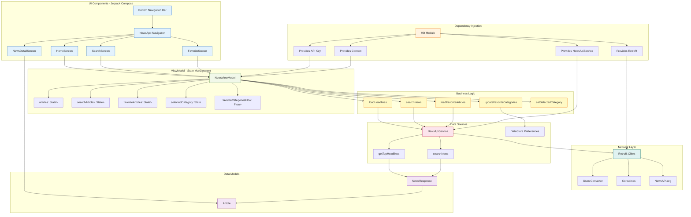
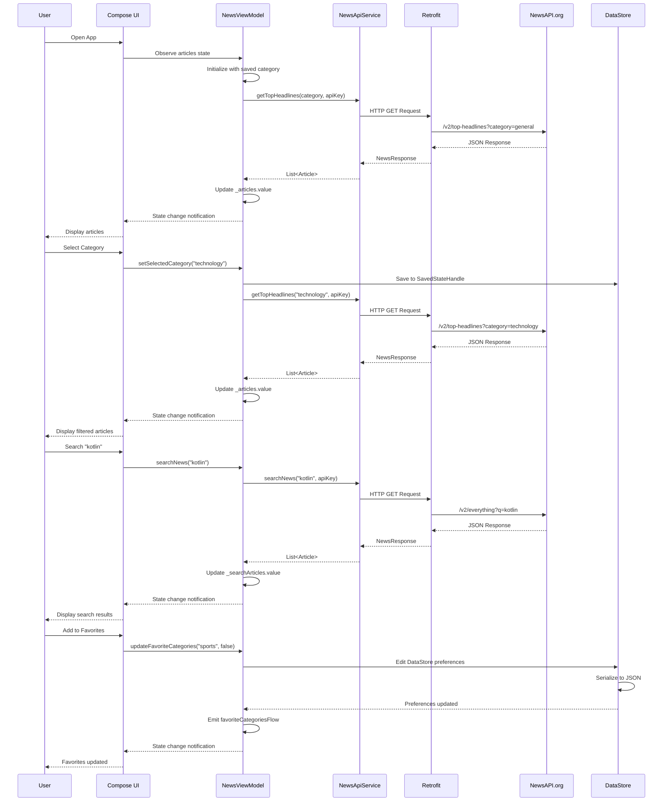
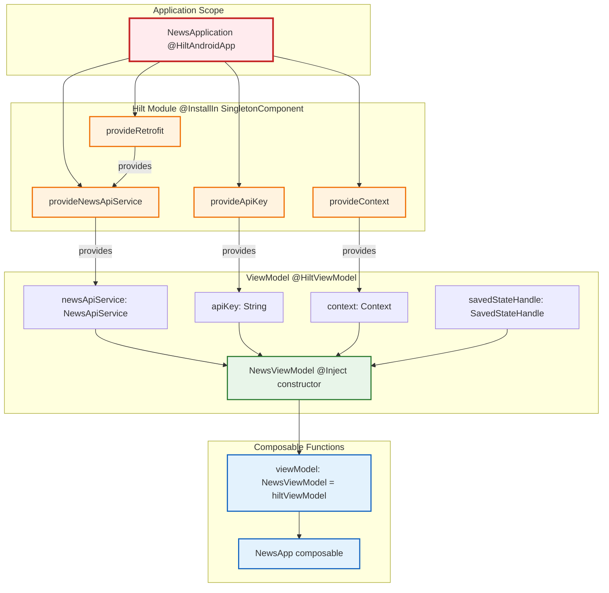
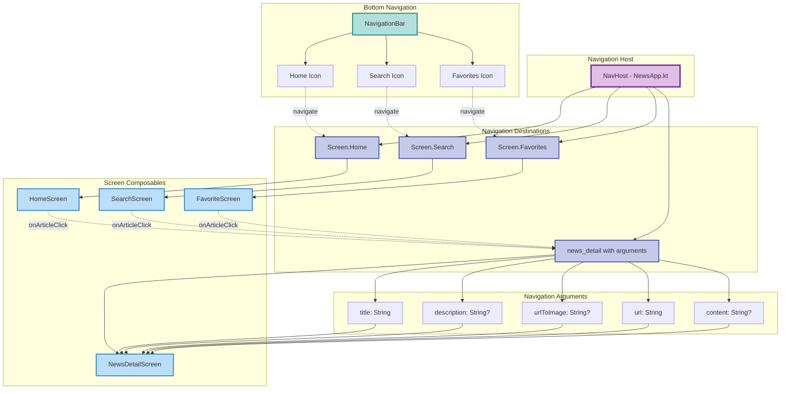

# System Architecture - News App

## Clean Architecture Layers

## MVVM Architecture Pattern

## Detailed Component Architecture

## Data Flow Architecture

## Dependency Injection Flow

## Navigation Architecture

## Layer Responsibilities

### Presentation Layer (UI)
**Location**: `view/` package

**Components**:
- `HomeScreen.kt` - Displays top headlines with category filtering
- `SearchScreen.kt` - Search interface for news articles
- `FavoriteScreen.kt` - Shows articles from favorite categories
- `NewsDetailScreen.kt` - Detailed article view
- `NewsApp.kt` - Navigation host and bottom navigation

**Responsibilities**:
- Render UI using Jetpack Compose
- Observe ViewModel state
- Handle user interactions
- Navigate between screens
- Display loading/error states

**Technologies**:
- Jetpack Compose
- Material Design 3
- Coil for image loading
- Navigation Component

### Domain Layer (Business Logic)
**Location**: `viewmodel/` package

**Components**:
- `NewsViewModel.kt` - Central business logic and state management

**Responsibilities**:
- Manage application state
- Execute business logic
- Coordinate data operations
- Handle coroutine scopes
- Persist UI state
- Transform data for UI

**Technologies**:
- ViewModel
- Kotlin Coroutines
- StateFlow/State
- SavedStateHandle
- Dagger Hilt

### Data Layer
**Location**: `model/` and `di/` packages

**Components**:
- `NewsApiService.kt` - API interface
- `RetrofitInstance.kt` - Network configuration
- `Article.kt` - Data model
- `NewsResponse.kt` - API response model
- `Module.kt` - Dependency injection configuration

**Responsibilities**:
- Fetch data from remote API
- Store/retrieve local preferences
- Provide data to domain layer
- Handle network requests
- Serialize/deserialize data

**Technologies**:
- Retrofit
- Gson
- DataStore
- Coroutines
- Dagger Hilt

### DI Layer
**Location**: `di/` package

**Components**:
- `Module.kt` - Hilt module providing dependencies
- `NewsApp.kt` - Application class with @HiltAndroidApp

**Responsibilities**:
- Provide singleton instances
- Inject dependencies
- Manage object lifecycle
- Configure application scope

**Technologies**:
- Dagger Hilt
- Singleton pattern

## Architecture Benefits

### Separation of Concerns
- Each layer has a single responsibility
- UI doesn't know about data sources
- Business logic is independent of UI
- Easy to modify individual layers

### Testability
- ViewModels can be tested without UI
- API service can be mocked
- Business logic is isolated
- Unit tests for each layer

### Maintainability
- Clear code organization
- Easy to locate functionality
- Consistent patterns throughout
- Well-defined boundaries

### Scalability
- Easy to add new features
- Can extend without breaking existing code
- Modular architecture
- Reusable components

### Dependency Management
- Automatic dependency injection
- No manual object creation
- Compile-time verification
- Reduced boilerplate
