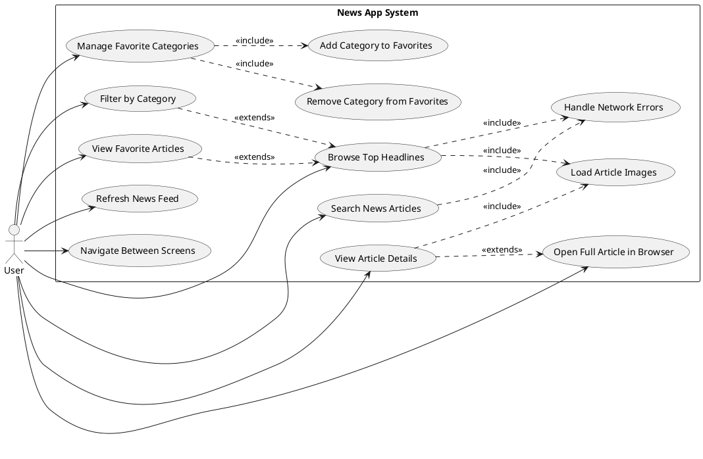
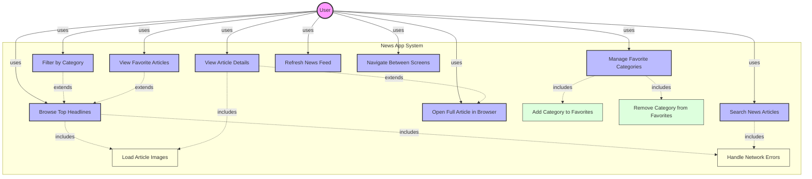

# Use Case Diagram - News App

## UML Use Case Diagram

## Mermaid Use Case Diagram

## Use Case Descriptions

### UC1: Browse Top Headlines
**Actor**: User  
**Description**: User views the latest news headlines from NewsAPI  
**Preconditions**: App is launched, internet connection available  
**Postconditions**: News articles are displayed on home screen  
**Flow**:
1. User opens the app
2. System fetches top headlines from NewsAPI
3. System displays articles with images and titles
4. User can scroll through the list

### UC2: Filter by Category
**Actor**: User  
**Description**: User filters news by category (General, Technology, Sports, Health, etc.)  
**Preconditions**: Home screen is displayed  
**Postconditions**: Filtered news articles are shown  
**Flow**:
1. User selects a category from the filter options
2. System fetches headlines for selected category
3. System updates the article list
4. Selected category is saved in SavedStateHandle

### UC3: Search News Articles
**Actor**: User  
**Description**: User searches for specific news articles by keyword  
**Preconditions**: User navigates to search screen  
**Postconditions**: Search results are displayed  
**Flow**:
1. User enters search query
2. System calls NewsAPI search endpoint
3. System displays matching articles
4. User can tap on any result to view details

### UC4: View Article Details
**Actor**: User  
**Description**: User views full details of a selected article  
**Preconditions**: Article list is displayed  
**Postconditions**: Article detail screen is shown  
**Flow**:
1. User taps on an article
2. System navigates to detail screen
3. System displays article image, title, description, and content
4. User can read the article or open in browser

### UC5: Open Full Article in Browser
**Actor**: User  
**Description**: User opens the complete article in external browser  
**Preconditions**: Article detail screen is displayed  
**Postconditions**: Browser opens with article URL  
**Flow**:
1. User taps "See More" button
2. System creates Intent with article URL
3. System launches browser
4. Full article is displayed in browser

### UC6: Manage Favorite Categories
**Actor**: User  
**Description**: User adds or removes favorite news categories  
**Preconditions**: User is on favorites screen  
**Postconditions**: Favorite categories are updated in DataStore  
**Flow**:
1. User selects/deselects categories
2. System updates favorite categories list
3. System persists changes to DataStore
4. Favorite articles are refreshed

### UC7: Add Category to Favorites
**Actor**: User  
**Description**: User adds a news category to favorites  
**Preconditions**: Category is not already in favorites  
**Postconditions**: Category is added to favorites list  
**Flow**:
1. User taps on category to add
2. System adds category to favorites list
3. System saves to DataStore using JSON serialization
4. UI updates to reflect change

### UC8: Remove Category from Favorites
**Actor**: User  
**Description**: User removes a category from favorites  
**Preconditions**: Category exists in favorites  
**Postconditions**: Category is removed from favorites  
**Flow**:
1. User taps to remove category
2. System removes category from list
3. System updates DataStore
4. Favorite articles are refreshed

### UC9: View Favorite Articles
**Actor**: User  
**Description**: User views articles from all favorite categories  
**Preconditions**: User has selected favorite categories  
**Postconditions**: Combined articles from favorites are displayed  
**Flow**:
1. User navigates to Favorites screen
2. System loads articles from each favorite category
3. System combines and deduplicates articles
4. Articles are displayed in a list

### UC10: Refresh News Feed
**Actor**: User  
**Description**: User manually refreshes the news feed  
**Preconditions**: User is on home or favorites screen  
**Postconditions**: Latest articles are fetched and displayed  
**Flow**:
1. User performs pull-to-refresh gesture
2. System makes fresh API call
3. System updates article list
4. Loading indicator is shown then hidden

### UC11: Navigate Between Screens
**Actor**: User  
**Description**: User navigates between Home, Search, and Favorites screens  
**Preconditions**: App is running  
**Postconditions**: Selected screen is displayed  
**Flow**:
1. User taps bottom navigation item
2. System navigates to selected destination
3. System preserves navigation state
4. Screen content is displayed

### UC12: Load Article Images
**Actor**: System  
**Description**: System loads article images asynchronously  
**Preconditions**: Article data contains image URL  
**Postconditions**: Images are displayed or placeholder shown  
**Flow**:
1. System receives article with urlToImage
2. Coil library loads image asynchronously
3. Image is cached for future use
4. Image or error placeholder is displayed

### UC13: Handle Network Errors
**Actor**: System  
**Description**: System gracefully handles network failures  
**Preconditions**: Network request is made  
**Postconditions**: Error is handled, user is informed  
**Flow**:
1. System makes API request
2. Network error occurs
3. System catches exception
4. Empty list is returned or error message shown
5. User can retry the operation

## System Responses

### Successful Article Load
- Display articles in scrollable list
- Show article images, titles, and descriptions
- Enable tap interactions for details

### Network Error
- Catch exception in try-catch block
- Log error message
- Return empty list
- Optionally show error UI

### Category Selection
- Update ViewModel state
- Persist selection to SavedStateHandle
- Fetch new articles for category
- Update UI with new data

### Search Query
- Validate query is not empty
- Call search API endpoint
- Display results or empty state
- Handle errors gracefully

### Favorite Management
- Update DataStore preferences
- Serialize/deserialize with JSON
- Emit Flow updates
- Refresh favorite articles list
